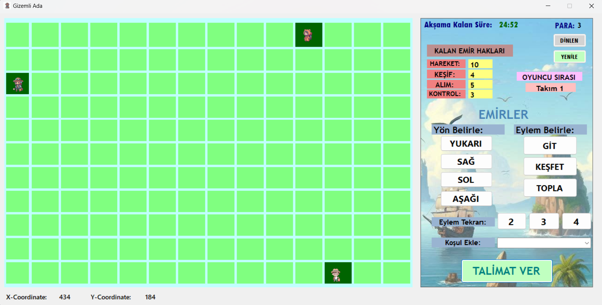

# Sosyal Sorumluluk Projesi: Gizemli Ada

## Proje Hedefi
Bu sosyal sorumluluk projemizde bir ilköğretim okuluna giderek okula teknik açıdan destek sağlamayı hedefledik. Öğretmenlere teknolojik konularda yardımcı olduk. Aşağıdaki görevlerde destek sağladık:
- Bilgisayarların yazılımsal olarak bakım yapılması (format atma)
- İnternet bağlantı sorunlarının giderilmesi
- Ofis programlarının kurulumu
- Yazıcı sorunlarının giderilmesi
- Öğretmenlerin okul etkinlikleri için hazırladıkları videoları editleme
- Çocuklarla aktivite gerçekleştirme

## Oyun Tasarımı: Gizemli Ada
Benim için oldukça eğlenceli bir süreç olan "Gizemli Ada" isimli oyunun tasarımını gerçekleştirdim. Bu oyun, **Visual Basic** dilinde ve **.NET teknolojisi** altyapısı ile geliştirildi. 

### Oyun Senaryosu
**4 Gezgin Ekibi ve Gizemli Hazine Avı: Büyük Yarış Başlıyor!**

Düşünün ki bir oyun adasındasınız ve bu adanın derinliklerinde bir yerde gizli bir hazine saklı. 🌴💎 Dört farklı ülkeden gelen 4 gezgin ekibi, bu büyülü adada hazineyi bulmak için bir araya geliyor. Ancak bu, sadece bir yarış değil; strateji, ekip çalışması ve zamana karşı bir mücadele!

Her ekibin lideri, "Kodlayıcı" olarak adlandırılan bir yönlendirici. Bu liderler, ekiplerini doğru ipuçlarına ve hedefe ulaştırmak için stratejiler geliştiriyor. Ama unutmayın, bu yarışın bir sınırı var: Akşam olana kadar hazineyi bulmak zorundalar. Çünkü güneş battığında, adanın karanlık ormanları yırtıcı hayvanlarla dolup taşıyor ve hayatta kalmak çok daha zorlaşıyor.

Kim akılcı hamlelerle, risk alarak ve en iyi takım ruhunu sergileyerek hazineye ilk ulaşan olacak? Bu yarışta sadece kazanan değil, yolda kazanılan deneyimler ve maceralar da unutulmaz olacak! 

Hazırsanız, yarış başlasın! 🚀

### Oyunun Amacı
Bu oyunun amacı, çocukların kodlama, strateji geliştirme becerilerini sağlamak ve eğlenceli bir şekilde aynı zamanda matematik ve hafıza becerilerini ölçmeyi amaçlıyor.

### Oyun Mekanikleri
Gezgin ekiplerinin hazineyi bulmak için yarıştığı bu heyecan verici oyunda, ilerlemek için aşağıdaki komutlar ve mekanikler kullanılır:

- **Komutlar ve Hareketler**: Ekipler, yönlerini belirlemek için temel komutlar kullanır:
  - **GİT (Go)**: Belirtilen yöne hareket etme
  - **KEŞFET (Explore)**: Bulunduğu kareyi keşfederek çevresindeki karelerin özelliklerini görme
  - **TOPLA (Collect)**: Bulunduğu karede bulunan öğeleri toplama
  - **Eğer... ise... (Conditional)**: Henüz geliştirilmemiş olan karar mekanizmaları ile ilerleme.

- **Görüş Menzili**: Keşfet komutu verildiğinde, ekip her adımda kendi bulunduğu karenin üst, alt, sağ ve sol karelerinin özelliklerini keşfeder (kontrol eder). Bu, çevredeki ipuçlarını ve engelleri belirlemenize yardımcı olur.

- **Engeller ve Matematik Soruları**: Yol boyunca karşılaşılan engelleri aşabilmek için matematiksel soruları doğru şekilde yanıtlamak gerekir. Bu, akıl yürütme becerilerinizi test eder ve stratejik düşünmeyi teşvik eder.

- **İpucu Kareleri ve Bonus Kareler**:
  - **İpucu kareleri**, doğru stratejiyi bulmanıza yardımcı olacak bilgiler taşır.
  - **Bonus kareleri**, oyuncuya para kazandırır ve ekstra hamle şansı sağlar.

- **Kod Hakkı ve Pas Geçme**:
  - Kod hakkı bittiğinde, ekip bir el pas geçer ve sıra diğer takımlara geçer. Ancak endişelenmeyin, sıra tekrar geldiğinde komut hakkınız artmış olur.
  - Bonus karelere gelmek, para kazanmak anlamına gelir ve bu da ilerlemenizi hızlandırabilir.

- **Kod Çalıştırma**: Her adımda "Talimat Ver" butonuna tıklayarak verilen komutları çalıştırabilir ve ilerleme kaydedebilirsiniz.

### Aksiyonlar için Binary Sistem ve Kodlama Mantığı
Aşağıda, oyunun kodlama mantığını ve aksiyonları nasıl temsil ettiğini gösteren bir sistem bulunmaktadır:
- **000 (None)**: 0
- **001 (Go)**: 1
- **010 (Control)**: 2
- **011 (Go + Control)**: 3
- **100 (Collect)**: 4
- **101 (Go + Collect)**: 5
- **110 (Control + Collect)**: 6
- **111 (Go + Control + Collect)**: 7

**Kontrol (Control)**: Keşif  
**Go (Go)**: Hareket  
**Collect (Collect)**: Toplama

Bu mekanikler sayesinde, her adımda zorlukları aşarak ve stratejilerinizi geliştirerek hazineyi bulmak için yarışabilirsiniz!
